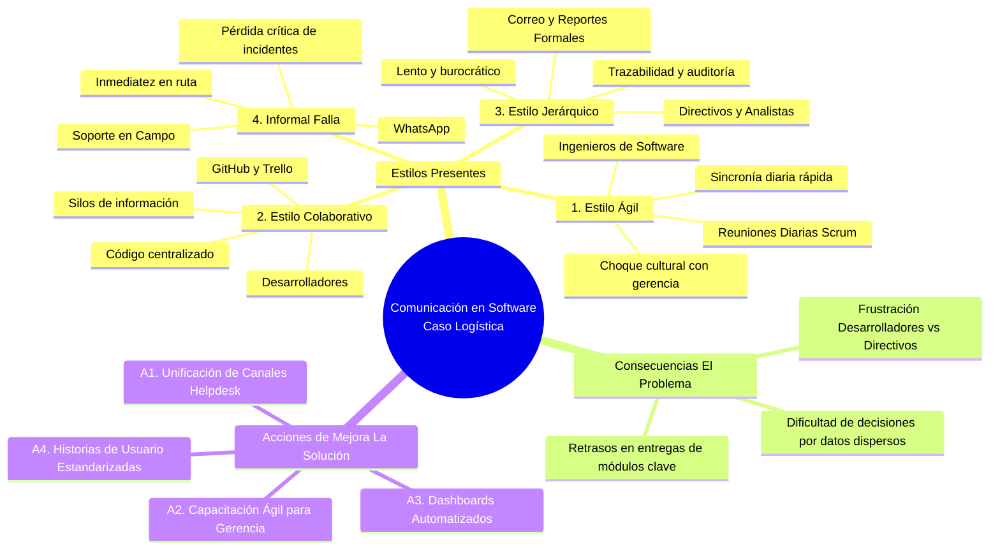

# 🗺️ Mapa Conceptual: Estilos de Comunicación en Proyectos de Software
**Programa de Formación:** Análisis y Desarrollo de Software (ADSO) - SENA  
**Caso de Estudio:** Proyecto de Desarrollo de Software (Sector Logística)  
**Objetivo:** Identificar los estilos de comunicación presentes, diagnosticar las fallas derivadas de su fragmentación y formular un plan de mejora estratégica.

---

## 🧭 1. Resumen Ejecutivo del Caso

En el desarrollo de un sistema para el **sector logístico**, conviven cuatro roles con métodos de trabajo divergentes:
1. **Ingenieros de Software:** Utilizan un *Estilo Ágil* con reuniones diarias cortas (*Daily Scrum*), pero sin involucrar a directivos.
2. **Desarrolladores:** Utilizan un *Estilo Colaborativo* mediante *GitHub y Trello*, generando "silos técnicos" inaccesibles para el área de negocio.
3. **Directivos y Analistas:** Utilizan un *Estilo Jerárquico Tradicional*, exigiendo reportes formales extensos por *Correo Electrónico*, lo cual genera lentitud y burocracia.
4. **Técnicos de Soporte en Campo:** Utilizan una *Comunicación Informal* por *WhatsApp*, provocando fuga de incidentes críticos y duplicidad de reportes.

> **Resultado del Choque:** Retrasos en entregas de módulos clave, frustración continua entre desarrollo y dirección, y toma de decisiones a ciegas por información dispersa.

---

## 📌 2. Diagrama de Flujo Conceptual (Mermaid Flowchart)

```mermaid
graph TD
    %% NODO CENTRAL
    NC["<b>Comunicación en el Proyecto de Software</b><br><i>(Caso Logística)</i>"]

    %% RELACIONES PRINCIPALES
    NC -->|se divide en| R1["<b>Estilos de Comunicación Presentes</b>"]
    NC -->|genera| R2["<b>Consecuencias del Proyecto</b><br><i>(El Problema)</i>"]
    NC -->|requiere| R3["<b>Acciones de Mejora</b><br><i>(La Solución)</i>"]

    %% SUB-RAMAS: ESTILOS
    R1 --> E1["<b>1. Estilo Ágil</b>"]
    R1 --> E2["<b>2. Estilo Colaborativo</b>"]
    R1 --> E3["<b>3. Estilo Jerárquico / Tradicional</b>"]
    R1 --> E4["<b>4. Comunicación Informal / Desestructurada</b><br><i>(Falla del proceso)</i>"]

    %% 1. ESTILO ÁGIL
    E1 -->|utilizado por| E1_U["Ingenieros de Software"]
    E1 -->|práctica principal| E1_P["Reuniones Diarias<br>(Scrum Meetings)"]
    E1 -->|medio digital| E1_M["Comunicación verbal /<br>Videoconferencia"]
    E1 -->|tiene ventajas| E1_V["<b>Ventajas:</b> Sincronización diaria,<br>rápida identificación de avances y obstáculos"]
    E1 -->|tiene desventajas| E1_D["<b>Desventajas en el caso:</b> Falta de participación directiva,<br>choque cultural con gerencia tradicional"]

    %% 2. ESTILO COLABORATIVO
    E2 -->|utilizado por| E2_U["Desarrolladores"]
    E2 -->|medios digitales| E2_M["Trello y GitHub"]
    E2 -->|tiene ventajas| E2_V["<b>Ventajas:</b> Centralización del código,<br>gestión visual de tareas, trabajo asíncrono"]
    E2 -->|tiene desventajas| E2_D["<b>Desventajas en el caso:</b> Creación de 'silos' de información;<br>analistas y directivos no usan las herramientas"]

    %% 3. ESTILO JERÁRQUICO
    E3 -->|utilizado por| E3_U["Directivos y Analistas de Negocio"]
    E3 -->|práctica principal| E3_P["Exigencia de Reportes y<br>Documentación Extensa"]
    E3 -->|medios digitales| E3_M["Correo Electrónico y Reportes Formales"]
    E3 -->|tiene ventajas| E3_V["<b>Ventajas:</b> Mantiene registro formal,<br>trazabilidad para auditorías y decisiones"]
    E3 -->|tiene desventajas| E3_D["<b>Desventajas en el caso:</b> Lento, burocrático,<br>desconectado del ritmo de desarrollo ágil"]

    %% 4. COMUNICACIÓN INFORMAL
    E4 -->|utilizado por| E4_U["Técnicos de Soporte en Campo"]
    E4 -->|medios digitales| E4_M["WhatsApp"]
    E4 -->|tiene ventajas| E4_V["<b>Ventajas:</b> Rapidez e inmediatez<br>desde el terreno"]
    E4 -->|tiene desventajas| E4_D["<b>Desventajas en el caso:</b> Pérdida de información crítica,<br>duplicidad de reportes, imposible de rastrear"]

    %% RAMA 2: CONSECUENCIAS (EL PROBLEMA)
    R2 -->|incluyen| C1["Retrasos en la entrega de módulos clave"]
    R2 -->|incluyen| C2["Frustración y malentendidos<br><i>(Desarrolladores vs. Directivos)</i>"]
    R2 -->|incluyen| C3["Dificultad para tomar decisiones rápidas<br>por información dispersa"]

    %% RAMA 3: ACCIONES DE MEJORA (LA SOLUCIÓN)
    R3 -->|acción 1| A1["<b>1. Unificación de Canales</b>"]
    A1 -->|consiste en| A1_C["Reemplazar WhatsApp por sistema de tickets formal integrado con GitHub/Trello"]

    R3 -->|acción 2| A2["<b>2. Capacitación en Metodologías Ágiles</b>"]
    A2 -->|consiste en| A2_C["Integrar a directivos y analistas en la cultura ágil (Sprint Reviews)"]

    R3 -->|acción 3| A3["<b>3. Protocolos de Reporte Automatizados</b>"]
    A3 -->|consiste en| A3_C["Dashboards automáticos en tiempo real para gerencia desde GitHub/Trello"]

    R3 -->|acción 4| A4["<b>4. Estandarización de Requerimientos</b>"]
    A4 -->|consiste en| A4_C["Convertir correos y reportes extensos en Historias de Usuario con Criterios de Aceptación"]

    %% ESTILOS VISUALES
    classDef central fill:#047857,stroke:#065f46,stroke-width:3px,color:#fff;
    classDef styles fill:#0284c7,stroke:#0369a1,stroke-width:2px,color:#fff;
    classDef problems fill:#b91c1c,stroke:#991b1b,stroke-width:2px,color:#fff;
    classDef solutions fill:#059669,stroke:#047857,stroke-width:2px,color:#fff;
    classDef leaf fill:#f8fafc,stroke:#cbd5e1,stroke-width:1px,color:#0f172a;

    class NC central;
    class R1,E1,E2,E3,E4 styles;
    class R2,C1,C2,C3 problems;
    class R3,A1,A2,A3,A4 solutions;
    class E1_U,E1_P,E1_M,E1_V,E1_D,E2_U,E2_M,E2_V,E2_D,E3_U,E3_P,E3_M,E3_V,E3_D,E4_U,E4_M,E4_V,E4_D,A1_C,A2_C,A3_C,A4_C leaf;
```



---

## 🧠 3. Diagrama de Mapa Mental Jerárquico (Mermaid Mindmap)



---

## 📊 4. Matriz Comparativa de Estilos de Comunicación

| Estilo de Comunicación | Actor / Rol Responsable | Canales y Herramientas | Prácticas Clave | Ventajas Principales | Desventajas / Riesgos en el Caso |
| :--- | :--- | :--- | :--- | :--- | :--- |
| **1. Ágil** | **Ingenieros de Software** | Verbal, Salas de reunión, Videoconferencias | *Daily Scrum*, sincronización corta de avances y bloqueos | Detección temprana de impedimentos; alta adaptabilidad | Brecha cultural con directivos; falta de visibilidad gerencial |
| **2. Colaborativo** | **Desarrolladores** | **GitHub**, **Trello** | Tableros Kanban, control de versiones, Pull Requests | Trabajo asíncrono ordenado; repositorio centralizado | "Silos de información" aislados de la gerencia y analistas |
| **3. Jerárquico / Tradicional** | **Directivos y Analistas de Negocio** | **Correo Electrónico**, Informes PDF/Word | Requerimientos exhaustivos, cadenas de aprobación | Respaldo documental, auditoría y control financiero | Lentitud en la retroalimentación; desfase con el ritmo de desarrollo |
| **4. Informal / Desestructurado** | **Técnicos de Soporte en Campo** | **WhatsApp**, Mensajería instantánea | Reporte directo desde campo de fallas operativas | Comunicación instantánea y sin fricción técnica inicial | Información no trazable, duplicidad y pérdida de incidentes críticos |

---

## ⚔️ 5. Matriz "Frente a Frente": Choques Culturales y Soluciones

```
┌───────────────────────────────────────┬────────────────────────────────────────────────────────┬────────────────────────────────────────────────────────┐
│ Choque de Roles (Vs)                  │ Conflicto Identificado                                 │ Solución Operativa Aplicada                            │
├───────────────────────────────────────┼────────────────────────────────────────────────────────┼────────────────────────────────────────────────────────┤
│ Directivos (Email) vs. Devs (GitHub)   │ Gerencia exige informes manuales extensos; Devs solo   │ Dashboards automáticos (Acción 3) e Historias de      │
│                                       │ actualizan repositorios que la gerencia no consulta.  │ Usuario en Trello con criterios claros (Acción 4).     │
├───────────────────────────────────────┼────────────────────────────────────────────────────────┼────────────────────────────────────────────────────────┤
│ Soporte Campo (WhatsApp) vs. Devs     │ Fallas en ruta quedan en chats personales y se pierden │ Reemplazar WhatsApp por Helpdesk / Tickets formal      │
│ (GitHub/Trello)                       │ sin llegar al backlog de desarrollo.                   │ integrado a Trello y GitHub (Acción 1).               │
├───────────────────────────────────────┼────────────────────────────────────────────────────────┼────────────────────────────────────────────────────────┤
│ Ingenieros (Scrum) vs. Directivos     │ Reuniones diarias resuelven bloqueos pero la gerencia  │ Capacitación en Cultura Ágil (Acción 2) con inclusión  │
│ (Cascada Tradicional)                 │ sigue exigiendo cronogramas rígidos y cerrados.        │ de directivos en Sprint Reviews quincenales.          │
└───────────────────────────────────────┴────────────────────────────────────────────────────────┴────────────────────────────────────────────────────────┘
```

---

## ⚠️ 6. Diagnóstico Causa $
ightarrow$ Efecto (El Problema)

```
                            INFORMACIÓN FRAGMENTADA Y CHOQUE METODOLÓGICO
                                                  │
          ┌───────────────────────────────────────┼───────────────────────────────────────┐
          ▼                                       ▼                                       ▼
┌───────────────────────────────────┐ ┌───────────────────────────────────┐ ┌───────────────────────────────────┐
│     1. IMPACTO EN CRONOGRAMA      │ │       2. IMPACTO EN CLIMA         │ │       3. IMPACTO EN GESTIÓN       │
├───────────────────────────────────┤ ├───────────────────────────────────┤ ├───────────────────────────────────┤
│ Retrasos en módulos clave porque  │ │ Frustración continua entre        │ │ Dificultad para tomar decisiones  │
│ requerimientos cambiaban por      │ │ Desarrolladores (agilidad) vs.    │ │ rápidas porque la información     │
│ correo sin sincronizarse en el    │ │ Directivos (burocracia manual     │ │ real estaba dispersa en 4 canales │
│ tablero de trabajo.               │ │ e informes extensos).             │ │ desconectados entre sí.           │
└───────────────────────────────────┘ └───────────────────────────────────┘ └───────────────────────────────────┘
```

---

## 🚀 7. Plan Estratégico de Transformación (Antes vs. Después)

| Acción de Mejora | Estado Anterior (Falla) | Estado Posterior (Solución) | Impacto Obtenido |
| :--- | :--- | :--- | :--- |
| **A1: Unificación de Canales de Soporte** | WhatsApp informal sin seguimiento ni trazabilidad. | Helpdesk / Sistema de Tickets integrado a GitHub/Trello. | **100% de trazabilidad** en incidencias de campo. |
| **A2: Capacitación Ágil para Gerencia** | Directivos desconectados exigiendo contratos en cascada. | Directivos capacitados participando en *Sprint Reviews*. | **Alineación cultural** y reducción de fricciones. |
| **A3: Reportes Automatizados** | Programadores perdiendo horas redactando informes Word. | Dashboards ejecutivos en tiempo real desde GitHub/Trello. | **Cero burocracia manual** y datos siempre al día. |
| **A4: Estandarización de Requerimientos**| Correos kilométricos con especificaciones ambiguas. | Historias de Usuario con Criterios de Aceptación (*Gherkin*).| **Requerimientos claros**, precisos y testeables. |

---

## 💻 8. Aplicación Web Interactiva Incluida

Este proyecto incluye una interfaz web interactiva con:
- **Modo Guiado Paso a Paso** para explicar la evidencia de forma dinámica.
- **Grafo Conceptual Interactivo** (Vis.js) con selector de modo Limpio / Completo y filtros por rama.
- **Simulador Frente a Frente (Vs)** para analizar el choque entre cualquier par de roles.
- **Mini-Quiz Interactivo** de 4 preguntas con feedback inmediato y animación de logro.
- **Exportación de Alta Resolución** a imagen PNG, PDF listo para impresión y código Mermaid.

👉 Abrir archivo: [`index.html`](file:///x:/SENA%20YEISON/Martes/Mapa/index.html)
